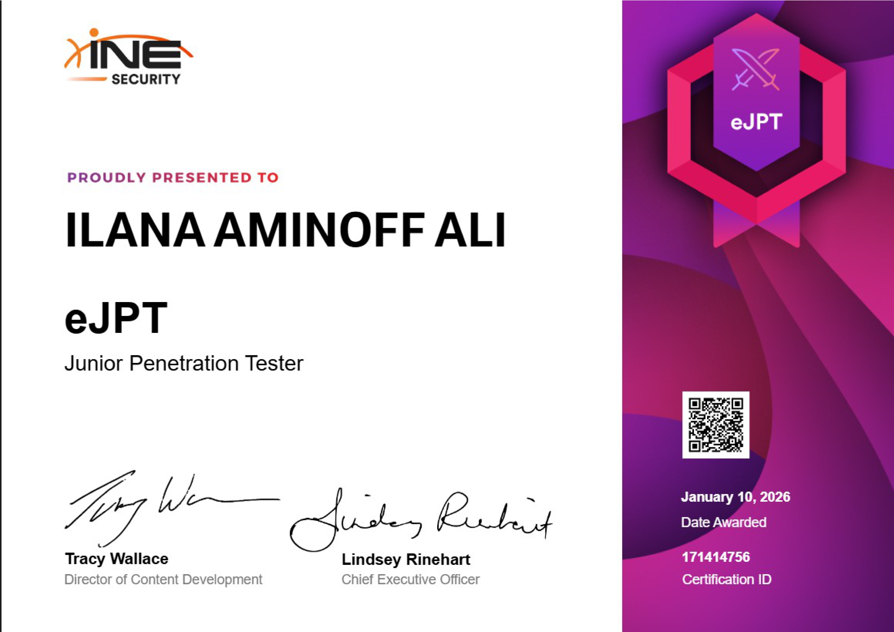
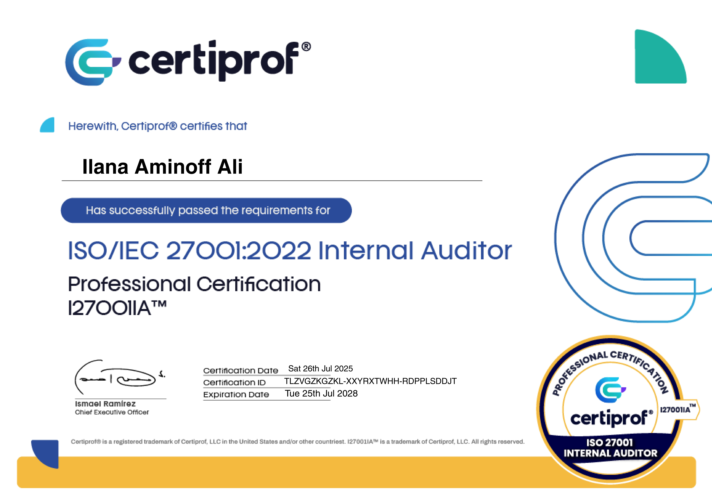
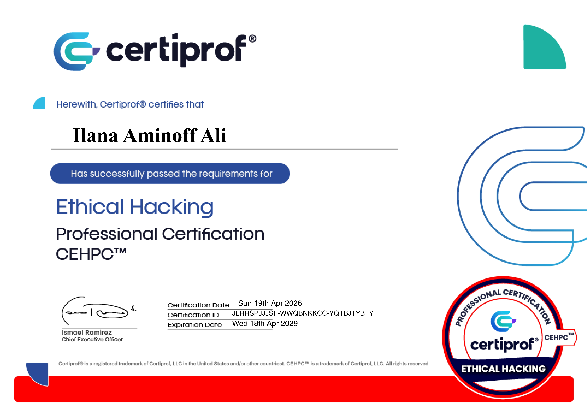
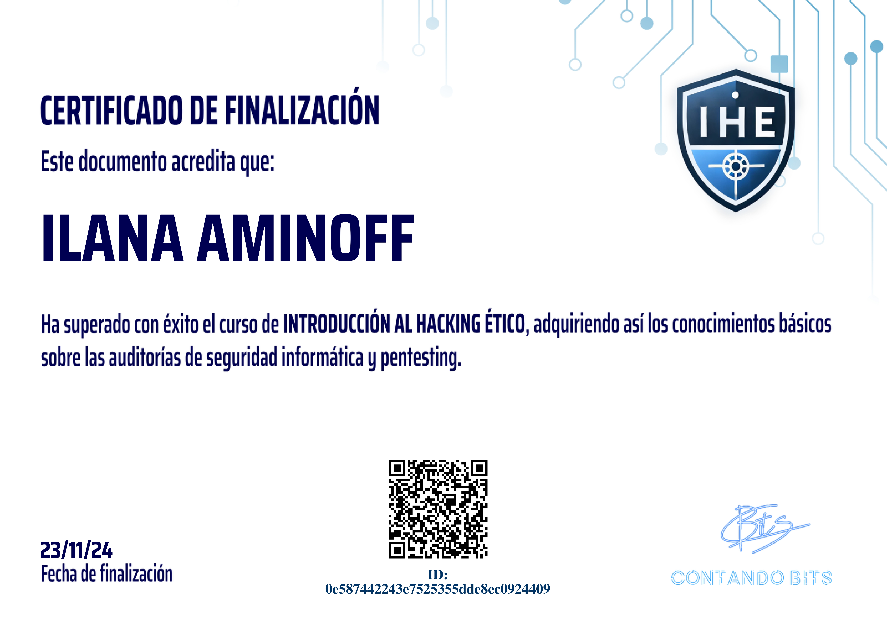
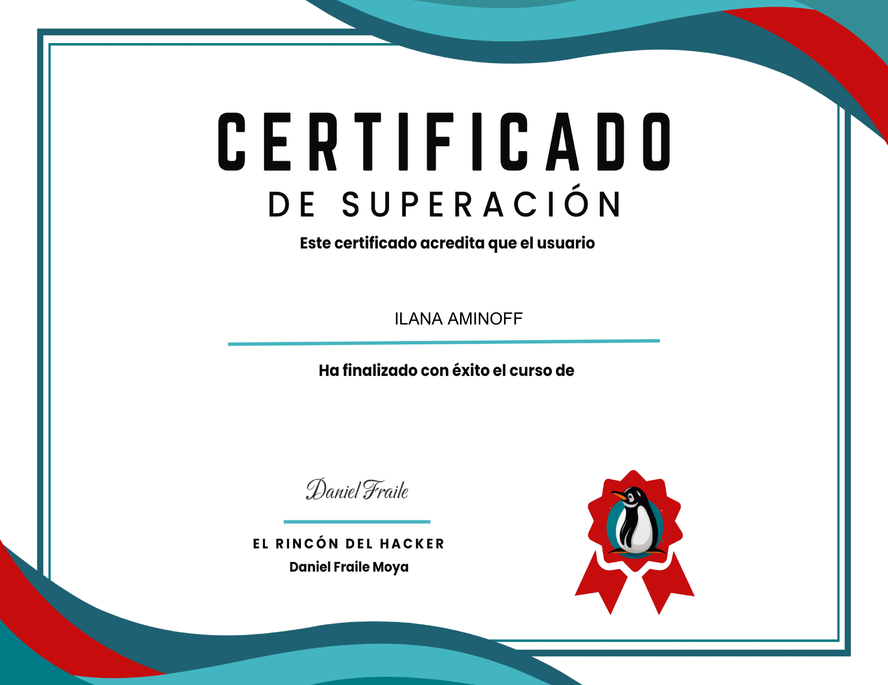
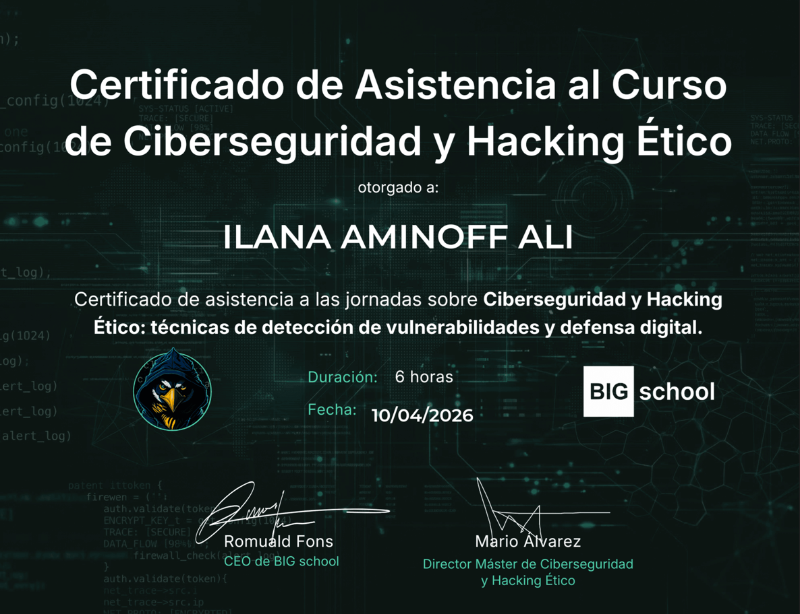
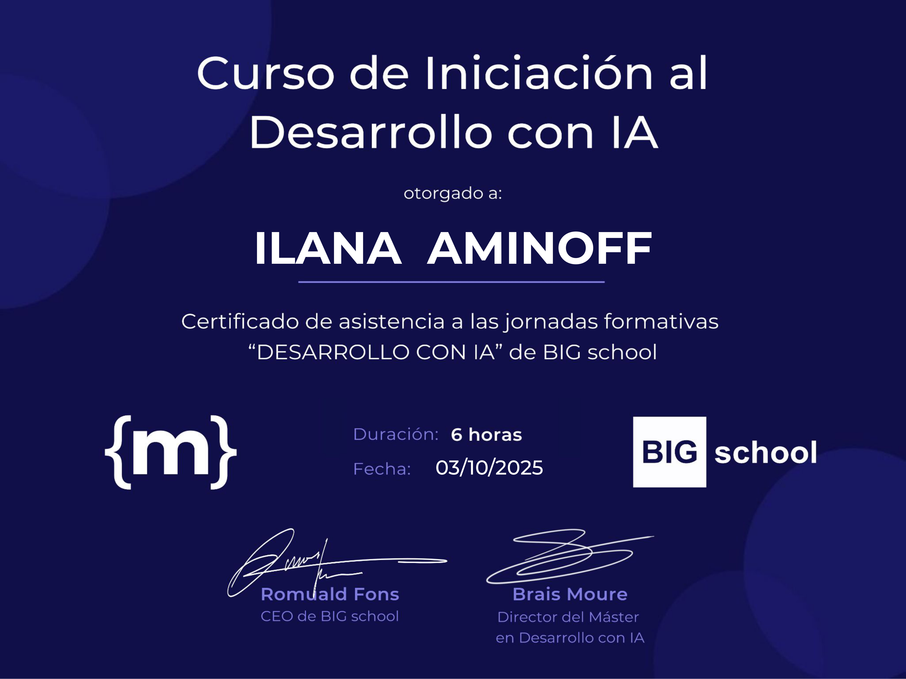

# Hola 👋, soy Ilana Aminoff

## 🛡️ Analista de Ciberseguridad | Pentesting & Blue Team | DFIR

**eJPTv2** · **ISO 27001:2022 IA** · **Digital Forensics** · **CEHPC** · **CEH en curso**

  
  
  
  

***

## 👩‍💻 Sobre mí

Especialista en Ciberseguridad con formación de alto nivel **(10/10 Proyecto Final + 10/10 Defensa Oral)** y experiencia práctica real en análisis forense de un incidente **BEC en entorno empresarial** (Elastic SIEM, 15+ IOCs identificados, mapeo MITRE ATT&CK).

Combino **10 años de gestión de incidentes técnicos bajo SLAs** con sólida formación en Pentesting Ofensivo, Blue Team, Incident Response y desarrollo de herramientas de seguridad en **Python y JavaScript**. Perfil que integra capacidad ofensiva, defensiva y de desarrollo.

🏆 **Top 42 Creator Ciberseguridad España — LinkedIn 2025**

***

## 🎯 Áreas de Especialización

- 🔴 **Red Team / Pentesting** — Web, Active Directory, infraestructura
- 🔵 **Blue Team / SOC** — Elastic SIEM, Incident Response, Threat Intelligence
- 🔍 **Forense Digital / DFIR** — Autopsy, Volatility, FTK, cadena de custodia
- 🛡️ **GRC / Compliance** — ISO 27001:2022, NIST, MITRE ATT&CK, CIS Controls
- 🐍 **Desarrollo de Herramientas** — Python, JavaScript, React, automatización N8N

***

## 🏆 Certificaciones y Reconocimientos

| Certificación | Entidad | Estado |
|---|---|---|
| eJPTv2 — Junior Penetration Tester | INE Security | ✅ Activa |
| ISO 27001:2022 Internal Auditor | CertiProf | ✅ Activa |
| Certified Digital Forensics | CertiProf | ✅ Activa |
| CEHPC — Certified Ethical Hacking Professional | HackerMentor | ✅ Activa |
| Pentester Mentor Elite 2025 | HackerMentor | 🥇 1.er Lugar |
| Curso Análisis Forense Digital | HackerMentor | ✅ Completado |
| Máster en Ciberseguridad (10/10) | Tokio School | ✅ Completado |
| CEH — Certified Ethical Hacker | EC-Council | 🟡 En curso |
| Máster en Desarrollo con IA | Big School | 🟡 En curso |

### 🖼️ Galería de Certificaciones

#### 🎓 Formación Principal y Certificaciones Profesionales

<table>
  <tr>
    <td align="center" width="25%">
      
       
      <b>Máster en Ciberseguridad</b> 400 horas · Proyecto Final 10/10 <i>Tokio School (2026)</i>
    </td>
    <td align="center" width="25%">
      
       
      <b>eJPTv2</b> Junior Penetration Tester <i>INE Security</i>
    </td>
    <td align="center" width="25%">
      
       
      <b>ISO/IEC 27001:2022</b> Internal Auditor (I27001IA) <i>CertiProf (2025–2028)</i>
    </td>
    <td align="center" width="25%">
      
       
      <b>HM Digital Forensics</b> Programa · 60 horas <i>Hacker Mentor (2025–2028)</i>
    </td>
  </tr>
  <tr>
    <td align="center" width="25%">
      
       
      <b>CEHPC</b> Certified Ethical Hacking Professional <i>HackerMentor</i>
    </td>
    <td align="center" width="25%">
      
       
      <b>Pentester Mentor Elite 2025</b> Reconocimiento · 1.er Lugar <i>HackerMentor</i>
    </td>
    <td align="center" width="25%"></td>
    <td align="center" width="25%"></td>
  </tr>
</table>

#### 🔬 Cursos Especializados

<table>
  <tr>
    <td align="center" width="25%">
      
       
      <b>ISO 27001:2022</b> Auditor Fundamentals · 5h <i>Hacker Mentor</i>
    </td>
    <td align="center" width="25%">
      
       
      <b>Peritaje e Informática Forense</b> 5 horas <i>Hacker Mentor</i>
    </td>
    <td align="center" width="25%">
      
       
      <b>ForensIA</b> IA aplicada a Informática Forense <i>Hacker Mentor</i>
    </td>
    <td align="center" width="25%">
      
       
      <b>Introducción a la</b> Informática Forense <i>Hacker Mentor</i>
    </td>
  </tr>
</table>

#### 🛠️ Talleres y Formación Complementaria

<table>
  <tr>
    <td align="center" width="25%">
      
       
      <b>Introducción al Hacking Ético</b> Auditorías y Pentesting <i>Contando Bits — IHE</i>
    </td>
    <td align="center" width="25%">
      
       
      <b>Hacking Web</b> Curso de Superación <i>El Rincón del Hacker</i>
    </td>
    <td align="center" width="25%">
      
       
      <b>Ciberseguridad y Hacking Ético</b> Detección de vulnerabilidades · 6h <i>BIG School</i>
    </td>
    <td align="center" width="25%">
      
       
      <b>Iniciación al Desarrollo con IA</b> 6 horas <i>BIG School</i>
    </td>
  </tr>
</table>

***

## 🛠️ Stack Tecnológico... **Pentesting:** Metasploit · Burp Suite · Nmap · Nessus · SQLMap · OWASP Top 10 · Wireshark
**Active Directory:** BloodHound · Impacket · Rubeus · Mimikatz · Kerberoasting · AS-REP Roasting · Golden/Silver Ticket
**SOC / Blue Team:** Elastic SIEM · Threat Intelligence · IOC Analysis · NIST IR · Timeline Analysis · Cadena de custodia
**Forense Digital:** Autopsy · Volatility · FTK · análisis RAM/disco · informes periciales
**Desarrollo:** Python · JavaScript · React · TypeScript · Flask · FastAPI · N8N
**DevSecOps:** Docker · Git · CI/CD · Jenkins · SAST/DAST
**Frameworks:** MITRE ATT&CK · PTES · NIST CSF · CIS Controls · ISO 27001
**Cloud & Sistemas:** Microsoft Azure AD · AWS · Kali Linux · Windows Server · hardening · iptables

  
  
  
  
  
  
  
  
  
  

***

## 🚀 Proyectos Destacados

### 🔐 Sistema de Auditoría Automatizada de Active Directory
**Proyecto Final del Máster · Calificación 10/10**

Laboratorio real con Vulnerable-AD y Windows Server 2016/2003. Identificación y explotación de **27 vulnerabilidades**, con reducción del **96,3% de la superficie de ataque** tras implementar las medidas correctivas.

- 🛠️ 2 herramientas Python propias: **AD-Analyzer Pro** (42 reglas de análisis) y **CryptoAD-Auditor** (auditoría Kerberos/PKI)
- ⚙️ Workflow N8N + API REST Flask con reportes HTML dinámicos
- 📚 250+ páginas de documentación técnica alineada con PTES, NIST, CIS y MITRE ATT&CK

🔗 [Ver proyecto completo](https://ilanami.github.io/auditoria-ad-proyecto)

***

### 📝 CTF Write-up Builder
**Aplicación web con IA integrada · React + TypeScript · ⭐ 36+ stars**

Herramienta para documentar resoluciones de Capture The Flag de forma estructurada y profesional. Adoptada por la comunidad hispanohablante.

🔗 [Demo](https://ctf-writeup-builder.vercel.app/) · [Repositorio](https://github.com/ilanami/ctf_writeup_builder)

***

### 🏰 IlaNami AD Guide
**Guía interactiva de Pentesting para Active Directory · JavaScript + HTML**

Recurso visual e interactivo con técnicas de explotación de AD y demo funcional en vivo.

🔗 [Demo](https://ilanami.github.io/llaNami-ADGuide/) · [Repositorio](https://github.com/ilanami/llaNami-ADGuide)

***

### 🔑 Password Security Tool
**Análisis de contraseñas según criterios NIST · Python**

🔗 [Repositorio](https://github.com/ilanami/password-tool)

***

## 📊 Estadísticas de GitHub

  

  

***

## ☕ Apoya mis proyectos open-source

Si mis herramientas te resultan útiles, puedes apoyar el desarrollo de futuros proyectos y certificaciones de ciberseguridad:

[
[
[

***

  <i>🛡️ Construyendo seguridad. Compartiendo conocimiento. Aprendiendo cada día.</i>

